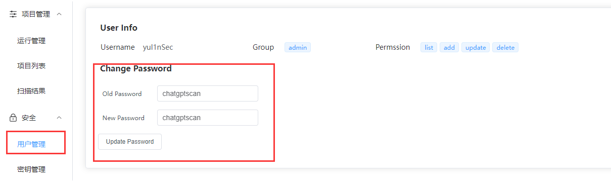
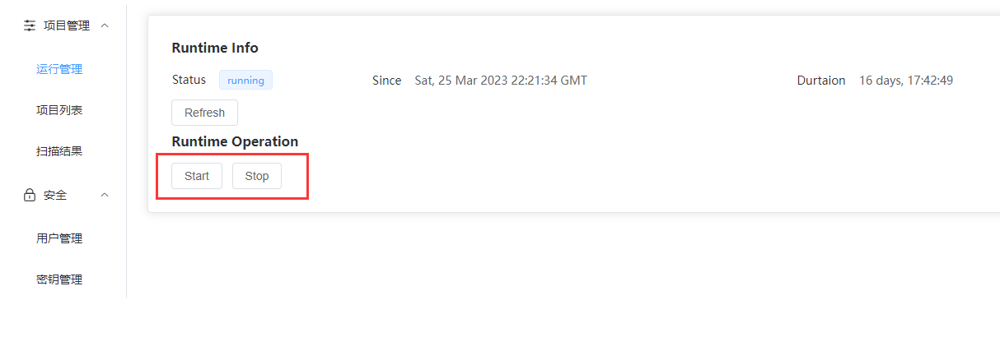
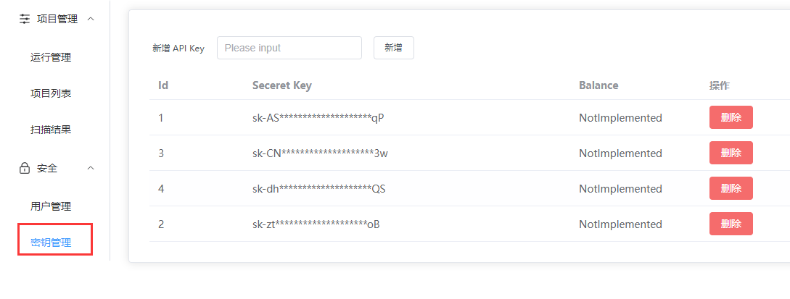

# ChatGPTScan-SAST
一个基于 ChatGPT 的开源代码审计平台。
- [ChatGPTScan-SAST](#chatgptscan-sast)
  - [介绍](#介绍)
  - [安装](#安装)
  - [使用](#使用)
    - [登录](#登录)
    - [启动/停止扫描](#启动停止扫描)
    - [密钥管理](#密钥管理)
    - [添加项目](#添加项目)
  - [最后](#最后)
## 介绍
此项目基于https://github.com/YulinSec/ChatGPTScanner

基本介绍可以看[这篇文章](https://mp.weixin.qq.com/s/QIKvRzNlAKiqh_UMOMfDdg)

## 安装
首先克隆项目
```
git clone https://github.com/YulinSec/ChatGPTScan-SAST
cd ChatGPTScan-SAST
```
然后在 `deploy/docker-compose.yml` 和 `web/config.yaml` 中配置数据库连接信息，要求两者一致
```yml
# deploy/docker-compose.yml
db:
  image: mysql:latest
  container_name: db
  environment:
    MYSQL_ROOT_PASSWORD: password
    MYSQL_DATABASE: ChatGPTScan
  volumes:
    - ./init.sql:/docker-entrypoint-initdb.d/init.sql
  ports:
    - "3306:3306"
# web/config.yaml
db:
  ip: db
  port: 3306
  username: root
  password: password
  database: ChatGPTScan
```
然后启动项目
```
cd deploy
docker-compose up -d
```
访问 `localhost:14433` 即可看到 web 管理页面，使用 `admin/aDmin13344` 登陆

## 使用

### 登录

`http://机器外网IP:14433`

默认账号密码`admin/aDmin13344`，记得改

> 权限、添加删除用户，都还没写，不是因为懒



### 启动/停止扫描

点一下就可以，默认没启动，记得先添加密钥



### 密钥管理

添加/删除之后，需要重启（停止->启动）

> Balance是用来显示API用量的，还没写



### 添加项目

> 这个也还没写...

目前添加项目的方式是直接向数据库添加，可以自己编写脚本向 MySQL 数据库的 project_source 表中导入项目

```python
import mysql.connector

# 连接MySQL数据库
mydb = mysql.connector.connect(
    host="127.0.0.1",
    user="root",
    password="password",
    database="ChatGPTScan"
)

# 创建一个游标对象
mycursor = mydb.cursor()

# 定义插入语句
sql = "INSERT INTO project_source (id, project_name, repo_link, language, category, foundation, last_update, last_scan) VALUES (%s, %s, %s, %s, %s, %s, %s, %s)"

# 打开一个文本文件，里面每行的内容都是 https://github.com/user/repo.git
with open("java.txt", "r") as f:
    data = list(map(lambda x: x.rstrip(),f.readlines()))

cache = {}
id = 0
for k in data:
    # 针对链接去重
    if k in cache:
        continue
    cache[k] = True
    project_name = k.split("/")[-1].split(".git")[0]
    repo_link = k
    category = "default"
    language = "java"
    foundation = ""
    last_update = None
    last_scan = None
    val = (id, project_name, repo_link, language,
       category, foundation, last_update, last_scan)
    id = id + 1
    mycursor.execute(sql, val)
    mydb.commit()
```

## 最后
1. 其实，这个项目还有很多命令行功能，不止ChatGPTScanner里的那些，如果喜欢命令行，可以探索一下
2. ChatGPT是一个很好的辅助工具，但其本质是大量数据+概率计算+矫正（大概这样？），没有很像人的逻辑思考，不要神话，沉心学习
   在开源这个轮子之前，我们做了大量的测试，光API费用就跑了500刀+，发现了很多瓶颈，最主要的就是token长度限制导致无法将大型项目的上下文连贯起来，tuning也无法根治，所以最终选择了局部文件+GPT选择+人工验证的方式；其次，通用型的模型对细分领域的训练还不足以达到较高水平，这块对算力和数据有很高的要求，个人只能望其项背；最后，太费钱了，项目加进去之后，花钱如流水。。。
3. 如果使用过程中发现bug，可以提issue，我们尽可能快地修复
4. 这个项目暂时不会更新了，功能需求也可以提issue，但大概率响应不会太快，见谅
5. 如果带着PR提issue，那绝对是大帅逼大漂亮
6. 后续会继续造一些有意思的轮子，欢迎大家围观 && 入群交流

公众号：御林安全


交流群：

